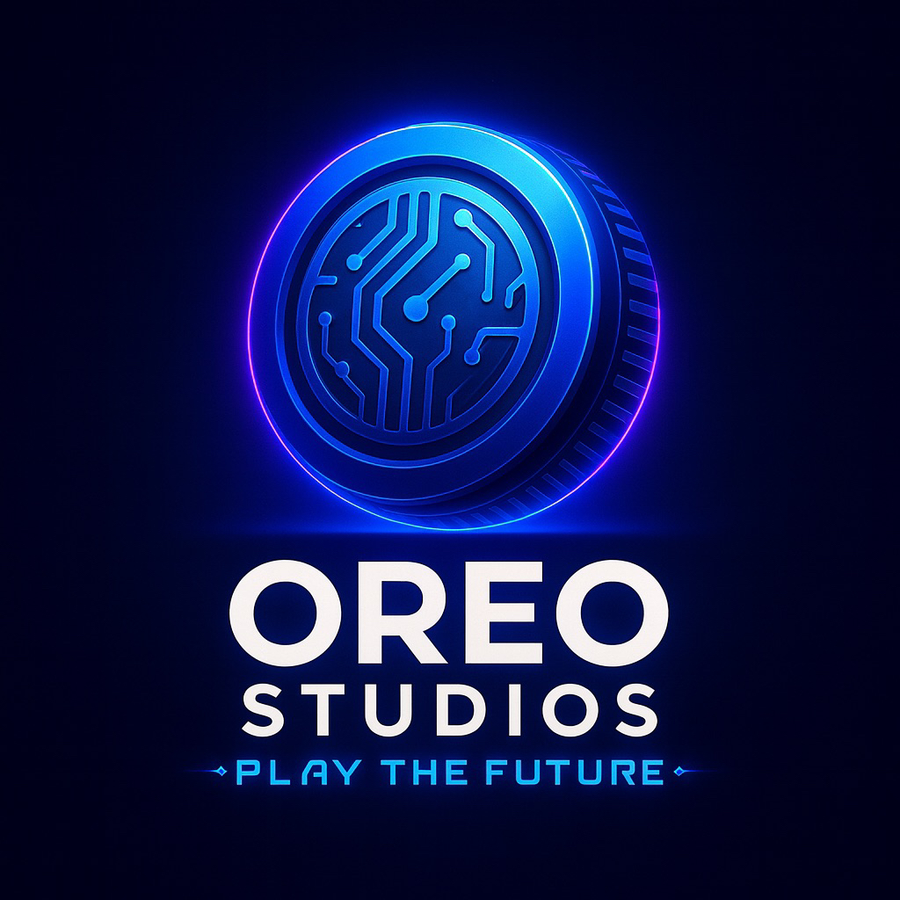
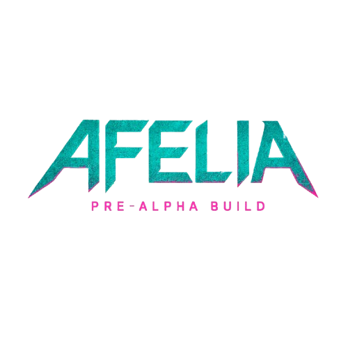

      

<h1 align="center">👋 HIIIIII — I'm Elias </h1>
<h3 align="center">🇫🇷 French Java & Web Developer | Founder of Oreo Studios 🍪</h3>

  

---

## Table of Contents
- [About](#about)
- [What I build](#what-i-build)
- [Tech & Tools](#tech--tools)
- [Featured Projects](#featured-projects)
- [Open Source Work](#open-source-work)
- [Contact](#contact)
- [How to support & collaborate](#how-to-support--collaborate)
- [Contributing](#contributing)
- [License](#license)

---

## About
I’m Elias  a passionate developer from France focused on server-side Java systems, game systems and web development. I build scalable server-side systems, multiplayer game mechanics, and engaging web dashboards. I run Oreo Studios and work on plugins, tools and games  including Afelia, an upcoming RPG/FPS title.

High-level experience:
- Java, Spigot/Paper plugin development (professional Minecraft plugins)
- Game engines: Unity (engine experience for gameplay, systems & prototyping)
- Full-stack web development (HTML/CSS/JS, Node.js, PHP, REST APIs)
- Databases & infra: MongoDB, Redis, MySQL, Docker, RabbitMQ
- Tools & patterns: Docker, CI, microservices patterns, message queues

---

## What I build
- Modern essentials & server tooling (cross-server sync, GUIs, performance-minded)
- Custom gameplay systems for Minecraft (drops, lotteries, item systems)
- Web dashboards & backend services to support game ecosystems
- Game worlds & narrative universes (Afelia — upcoming RPG/FPS)

---

## Tech & Tools

<!-- Combined icon row (single image) to avoid "gaps"; includes Unity -->

  

Short skills (text)
- Java — 100%
- Python — 100%
- JavaScript / TypeScript — 90%
- C# (.NET) & Unity scripting — 80%
- PHP — 60%
- Bash / Shell — comfortable

Datastores & infra (text)
- MongoDB, Redis, MySQL
- Docker, Linux, Pterodactyl
- RabbitMQ

Frameworks & libraries (text)
- Spigot / Paper, MythicMobs, ModelEngine, ItemsAdder
- Unity engine (game systems, prototyping)
- Express, Node.js, REST APIs
- Spring / Java tooling

---

## Featured Projects
Below are some of my highlighted projects. Click to visit each repository or the game page.

| Project | Short description |
|--------:|------------------|
|  OreoEssentials | Modern essentials core for cross-server sync, MongoDB-backed data, advanced GUIs. — https://github.com/el211/OreoEssentials |
| MythicDrop | Custom drop system for MythicMobs with configurable tables and rarity weighting. — https://github.com/el211/MythicDrop |
| Afelia | Upcoming sci‑fi RPG/FPS — game systems, mechanics & lore. Pre‑alpha — coming to Steam. — http://afeliathegame.com/ |
  

    <!-- Place the Afelia logo in the repo at assets/afelia-logo.png for this to render.
         If you want, I can add it to the repo for you. -->
    
  

---

## Open Source Work & GitHub Stats

  
  

<!-- GitHub achievement trophies -->

  

<!-- Contribution / activity widgets -->

  

  

  

  

<!-- Total commits & other badges (third-party services) -->

  
  
  

---

## Contact
- Email: support@oreostudios.info
- Discord: OreoStudios
- Website / Shop: https://www.oreostudio.store/
- Afelia game: http://afeliathegame.com/
- GitHub: https://github.com/el211

---

## How to support & collaborate
- Star the repositories you find useful ⭐
- Open issues or feature requests in the repo you want improved
- If you want custom work, email me or reach out on Discord

---

## Contributing
Contributions are welcome — bug reports, improvements, documentation updates, or new features.
1. Fork the repository
2. Create a feature branch (git checkout -b feat/my-feature)
3. Commit your changes and push (git push origin feat/my-feature)
4. Open a pull request with a clear description of changes

Please follow the repository's code style and include tests where relevant.

---

## License
Most of my public repositories use permissive licenses. If you want me to add or change a license for a specific repo, tell me which one; I can add an MIT or Apache-2.0 license file and update the README.

---

## Final notes
Thanks for visiting — if you like my work or want help on a plugin, game system, or web tool, reach out. And yes — I love Oreos 🍪
