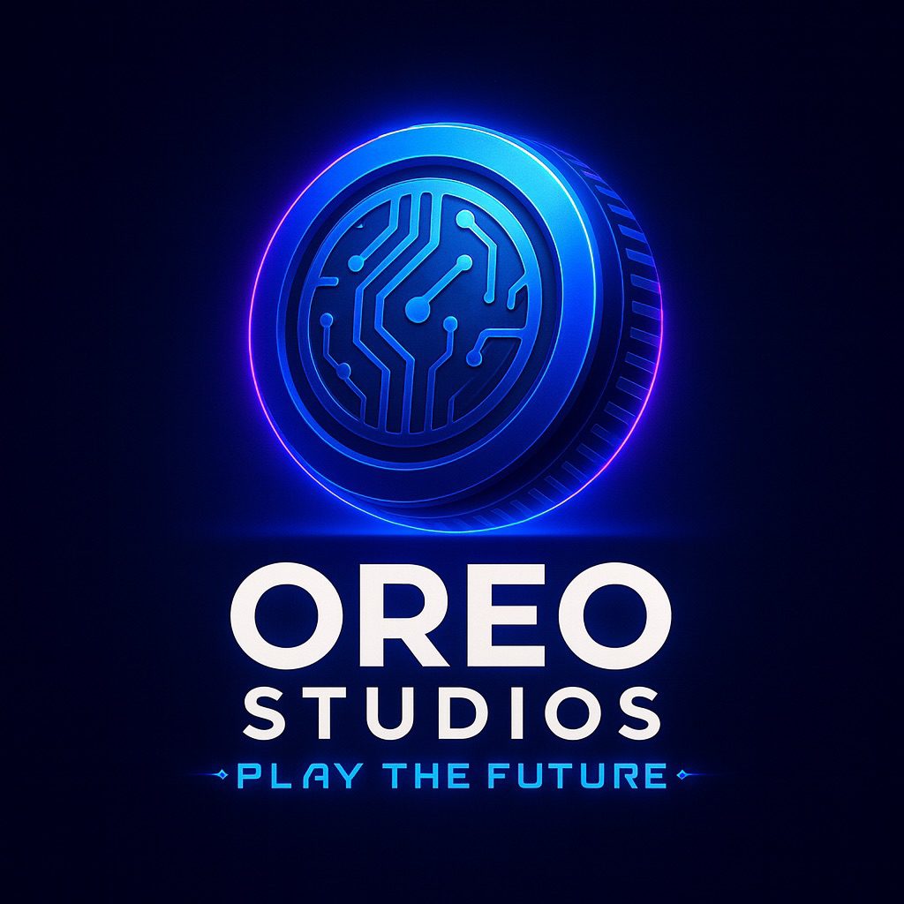
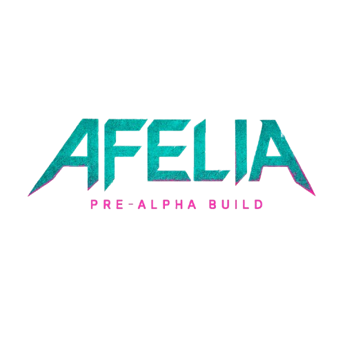

      

<h1 align="center">👋 HIIIIII — I'm Elias </h1>
<h3 align="center">🇫🇷 French Java & Web Developer | Founder of Oreo Studios 🍪</h3>

  

---

## Table of Contents:
- [About](#about)
- [What I build](#what-i-build)
- [Tech & Tools](#tech--tools)
- [Featured Projects](#featured-projects)
- [GoCraft — Minecraft, rebuilt in Go](#gocraft--minecraft-rebuilt-in-go-)
- [Open Source Work](#open-source-work)
- [Contact](#contact)
- [How to support & collaborate](#how-to-support--collaborate)
- [Contributing](#contributing)
- [License](#license)

---

## About
I’m Elias  a passionate java developer from France focused on server-side Java systems, game systems and web development. I build scalable server-side systems, multiplayer game mechanics, and engaging web dashboards. I run Oreo Studios and work on plugins, tools and games  including Afelia, an upcoming RPG/FPS title.

🎓 Currently studying at **Epitech Strasbourg**.

High-level experience:
- Java, Spigot/Paper plugin development (professional Minecraft plugins)
- Game engines: Unity, LibGDX, jMonkeyEngine (engine experience for gameplay, systems & prototyping)
- Full-stack web development (HTML/CSS/JS, Node.js, PHP, REST APIs)
- Databases & infra: MongoDB, Redis, MySQL, Docker, RabbitMQ
- Tools & patterns: Docker, CI, microservices patterns, message queues

---

## What I build
- Modern essentials & server tooling (cross-server sync, GUIs, performance-minded)
- Custom gameplay systems for Minecraft (drops, lotteries, item systems)
- Web dashboards & backend services to support game ecosystems
- Game worlds & narrative universes (Afelia — upcoming RPG/FPS)
- A from-scratch Minecraft server in Go with native Java & Bedrock support (GoCraft)

---

## Tech & Tools

<!-- Combined icon row (single image) to avoid "gaps"; includes Unity -->

  

Short skills (text)
- Java — 100%
- Python — 100%
- JavaScript / TypeScript — 90%
- C# (.NET) & Unity scripting — 80%
- PHP — 60%
- Bash / Shell — comfortable

Datastores & infra (text)
- MongoDB, Redis, MySQL
- Docker, Linux, Pterodactyl
- RabbitMQ

Frameworks & libraries (text)
- Spigot / Paper, MythicMobs, ModelEngine, ItemsAdder
- Unity, LibGDX, jMonkeyEngine (game systems, prototyping)
- Express, Node.js, REST APIs
- Spring / Java tooling

---

## Featured Projects
A selection of my highlighted work across game servers, web apps, libraries and games. Click any name to open the repo or page.

### 🎮 Games & Engines
| Project | Description |
|---|---|
| [**GoCraft**](https://github.com/GoCraft-MC) | A from-scratch Minecraft server written in **Go** with native **Java & Bedrock** support and a multi-runtime plugin system. |
| [**Afelia**](http://afeliathegame.com/) | Upcoming sci‑fi **RPG/FPS** — game systems, mechanics & lore. Pre‑alpha, coming to Steam. |

### 🌐 Web & Backend (Spring Boot / Full-stack)
| Project | Stack | Description |
|---|---|---|
| [**ZyntralAI**](https://github.com/el211/ZyntralAI) | Java · Spring Boot | AI platform backend — REST API and services built on Spring Boot. |
| [**ZyntralAI-FrontEnd**](https://github.com/el211/ZyntralAI-FrontEnd) | TypeScript | Web front-end for the ZyntralAI platform. |
| [**ZyntralAI-voice**](https://github.com/el211/ZyntralAI-voice) | Python | Voice/speech services for ZyntralAI. |
| [**team-flow-api**](https://github.com/el211/team-flow-api) | Go | Backend API for team/workflow management. |

### 🧩 Minecraft Plugins
| Project | Description |
|---|---|
| [**OreoEssentials**](https://github.com/el211/OreoEssentials-) | The most advanced all-in-one Essentials plugin for **Paper 1.21+** — cross-server sync, MongoDB-backed data, advanced GUIs. Free & open-source. |
| [**MythicDrops-Refactored**](https://github.com/el211/MythicDrops-Refactored) | Custom drop system for MythicMobs with configurable tables and rarity weighting. |
| [**zCrates**](https://github.com/el211/zCrates) | A scriptable crate system with full flexibility to create unique animations. |
| [**SmartMenus-V2**](https://github.com/el211/SmartMenus-V2) | Advanced menu/GUI framework powered by the SmartInvs API. |
| [**HoloCreator**](https://github.com/el211/HoloCreator) | Easy-to-use holograms plugin. |

### 📚 Libraries & Tools
| Project | Description |
|---|---|
| [**Structura**](https://github.com/el211/Structura) | Type-safe YAML configuration library for **Java 21+** with automatic type conversion. |
| [**BDApi**](https://github.com/el211/BDApi) | Lightweight Java API for creating, animating and adding physics to Block Displays on Paper. |
| [**OreoLib**](https://github.com/el211/OreoLib) | Utility library that makes writing Java plugins easier. |
  

    <!-- Place the Afelia logo in the repo at assets/afelia-logo.png for this to render.
         If you want, I can add it to the repo for you. -->
    
  

---

## GoCraft — Minecraft, rebuilt in Go 🍪⛏️

  

I founded and lead **[GoCraft](https://github.com/GoCraft-MC)** ([gocraft.fr](https://gocraft.fr)) — an open‑source organization rewriting the Minecraft server **from scratch in Go**. Our goal is a single high‑performance server with **native support for both Java and Bedrock** editions, plus a **multi‑runtime plugin system** so developers can extend the server in Go *and* Java.

What we're building:
- **GoCraft** — the core server implementation, fully written in Go
- **gocraft-jvm** — a Java runtime that hosts JVM plugins inside the server
- **gocraft-api-go** / **gocraft-abi** — the plugin API and binary interface layer
- **gocraft-cli** — command‑line tooling for running and managing servers
- **gocraft-plugin-examples** & **WorldGuard‑GO** — sample plugins to get developers started

  
  
  
  

---

## Open Source Work & GitHub Stats

<!-- Profile overview + streak (reliable hosts) -->

  

  

  
  

  
  

<!-- Profile views -->

  

---

## Contact
- Email: support@oreostudios.info
- Discord: OreoStudios
- Website / Shop: https://oreostudios.fr/
- GoCraft: https://gocraft.fr/ — https://github.com/GoCraft-MC
- Afelia game: http://afeliathegame.com/
- GitHub: https://github.com/el211

---

## How to support & collaborate
- Star the repositories you find useful ⭐
- Open issues or feature requests in the repo you want improved
- If you want custom work, email me or reach out on Discord

---

## Contributing
Contributions are welcome — bug reports, improvements, documentation updates, or new features.
1. Fork the repository
2. Create a feature branch (git checkout -b feat/my-feature)
3. Commit your changes and push (git push origin feat/my-feature)
4. Open a pull request with a clear description of changes

Please follow the repository's code style and include tests where relevant.

---

## License
Most of my public repositories use permissive licenses. If you want me to add or change a license for a specific repo, tell me which one; I can add an MIT or Apache-2.0 license file and update the README.

---

## Final notes
Thanks for visiting — if you like my work or want help on a plugin, game system, or web tool, reach out. And yes — I love Oreos 🍪
